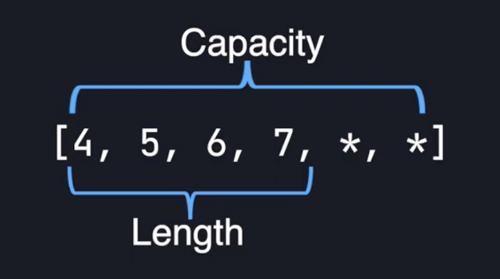
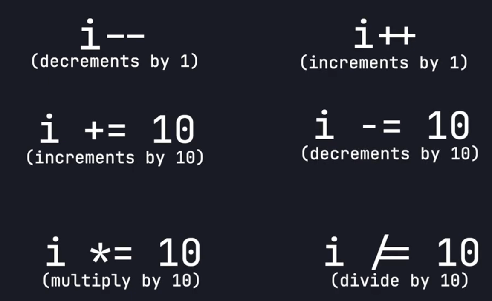
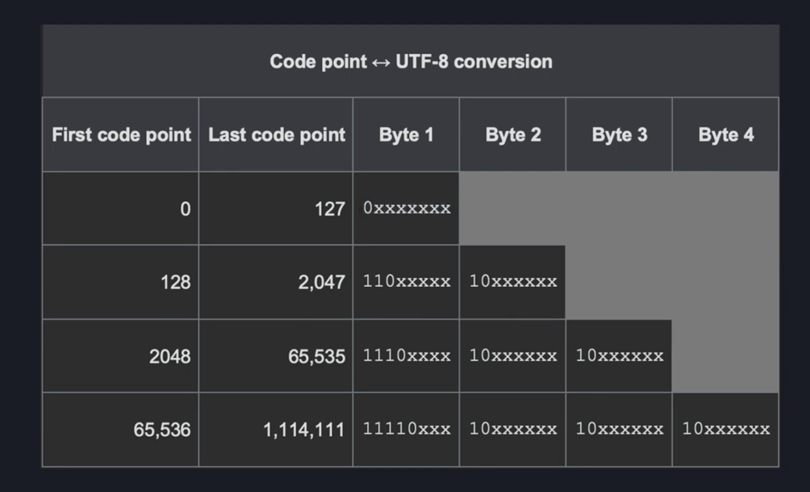
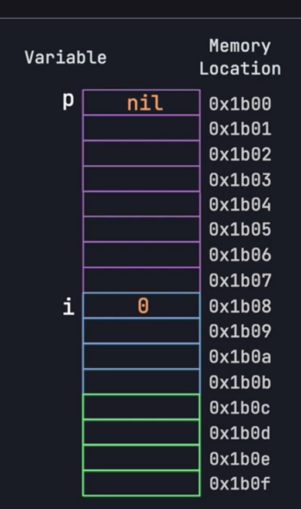
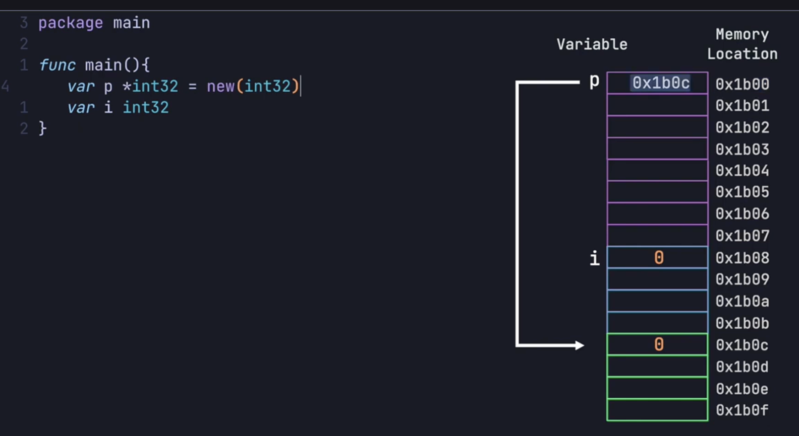
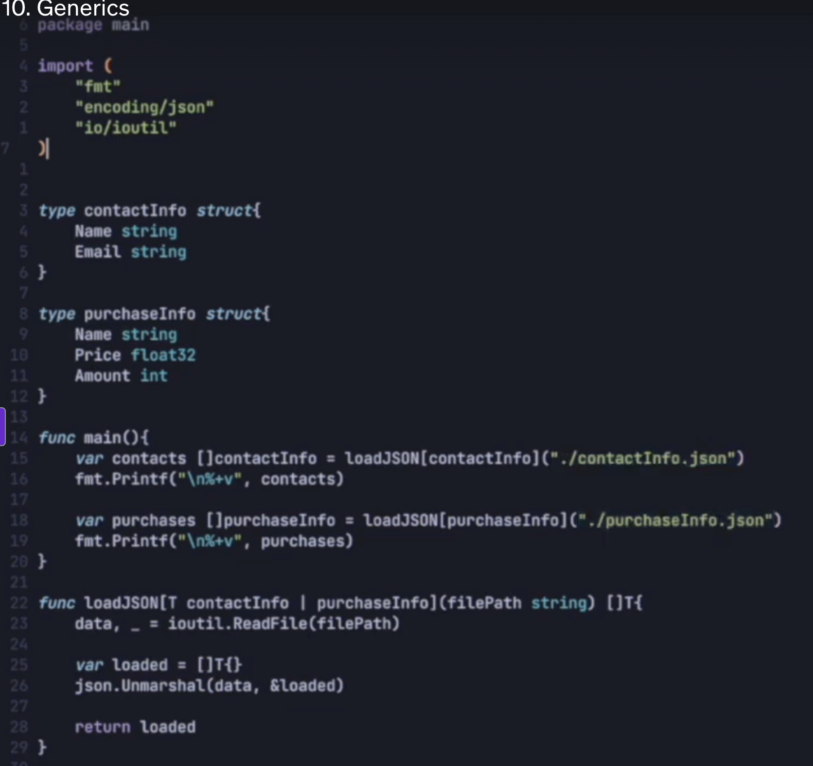

# learnGo-GolangForExperiencedDevs
Code Snippets for a Go course: Golang for Experienced Devs

## Six Main Points about Go
### 1 - Statically Typed Language
```Go
var myVariable string
// or
var myVariable = "myString"
```

### 2 - Strongly Typed Language
In Go, we cannot do something like this:
```go
a = 1
b = "two"
c = a + b
```

### 3 - Go is compiled
### 4 - Fast Compile Time
### 5 - Built In Concurrency
Goroutines are great.

### 6 - Simplicity


## Starting a new project

```bash
go mod init <project-name>
```

### A Hello World
```bash
$ tree
.
├── cmd
│   └── tutorial1
│       └── main.go
└── go.mod

2 directories, 2 files
$ cat cmd/tutorial1/main.go
```

```go
package main

import "fmt"

func main() {
    fmt.Println("Hello World")
}
```

Building:
```bash
go build cmd/tutorial1/main.go
```

Running:
```bash
./main
```
or:
```bash
go run cmd/tutorial1/main.go
```

## Variable Types
```go
var intNum int8 // or int16, int32, int64
```
```go
var intNum uint // or uint8, uint16, uint64 
```
```go
var floatNum float64 // or float32
```

### We cannot perform operations with mixed types
The following leads to a compile error:
```go
var floatNum32 float32 = 10.1
var intNum int32 = 2
var result float32 = floatNum32 + intNum
```

For multiline string variables
var myName string = `
Leonardo
Gutierrez
Ramirez
`

To handle fancy strings, it is better to use a specialized package such as: _unicode/utf8_, and:
```go
fmt.Println(utf8.RuneCountInString("Y"))
```

## Default values for types
uint, uint8, uint16, uint32, uint64
int, int8, int16, int32, int64
float32, float64
rune
is 0 ...

## Ways of declaring a variable
```go
name := "Leonardo"
var name = "Leonardo"
var name string = "Leonardo"
```

This is also possible:
```go
x1, x2 := 1, 2
var y1, y2 = 1, 2
```

## Constants
They need to be declared and assign a value in the same line.
```go
const myName string = "Leonardo"
```

## Functions
```go
func main() {
    printMe()
}

func printMe() {
}

func printMe2(printValue string) {
}
```

```go
func rValue1() int {
    return 1
}
```

Returning multiple values:

```go
func x() (int, int) {
    return 1, 1
}
```

## Ignoring a returning value
The _string_ value is ignored.
```go
someVal, _ := myFunc()
fmt.Println(someVal)

func myFunc() (int, string) {
	return -1, "Leo"
}

```

## Default value of _error_ 
The default value of the _error_ type is nil.

## Conditional switch statement
```go
switch remainder {
case 0:
    fmt.Println("The division was exact")
case 1, 2:              // 1 or 2
    fmt.Println("The division was close")
default:            // anything else
    fmt.Println("The division was not close")
}
```

## Arrays
- Fixed length
- Same Type
- Indexable
- Contiguous in memory

### How to initialize them
```go
var intArr [3]int32 = [3]int32{4, 2, 6}
intArr[1] = 123
```
or:
```go
intOther := [3]int32{4, 5, 6}
```
or inferring the size:
```go
intOther := [...]int32{5, 2, 65}
```

## Slices
"Slices wrap arrays to give a more general, powerful, and convenient interface to sequence of data."

### Example
```Go
var intSlice []int32 = []int32{4, 5, 6}
fmt.Println(intSlice)
```

### Adding an element to a slice
```Go
intSlice = append(intSlice, 7)
```

### len(x) and cap(x) methods


### Appending multiple elements using the spread operator
```Go
	intSlice2 := []int32{8, 9}
	intSlice = append(intSlice, intSlice2...)

	fmt.Println(intSlice)
```

### Creating slices with make()
```go
var intSlices3 []int32 = make([]int32, 5)
fmt.Println(intSlices3)
```

## Maps
- key, value pairs
- Returns a default value of the value type if the key does not exist.

### Creation
```go
dict1 := make(map[string]int)
```

### Add element and get
```go
    dict1 := make(map[string]int)
	fmt.Println(dict1)

	dict1["leonardo"] = 34
	fmt.Println(dict1)

	fmt.Println(dict1["leonardo"])
```

### Literal initialisation
```go
var ages = map[string]uint8{"Perla":33, "Leonardo":34}
```

### Check if an element does not exist
In the following code, `ok` will contain true or false if the key exists.
```go
if mariaAge, ok := ages["maria"]; ok {
	fmt.Println(mariaAge)
}
```

### Remove an element
`delete(myMap, key)`

## Iterating through collections
```go
    ages["maria"] = 55

	for name, age := range ages {
		fmt.Printf("%s has %d age\n", name, age)
	}
```

With an array:
```go
var nums [3]int = [3]int{33, 34, 29}
for i, v := range nums {
	fmt.Printf("i(%d) = %d\n", i, v)
}
```

### For loops
```go
var i int = 0
for i < 10 {
    fmt.Println(i)
    i++
}
```

```go
    var i int = 0
	for {
        fmt.Println(i)
		if i > 10 {
			break
		}
		i++
	}
```

```go
for i := 0; i < 10; i++ {
    fmt.Println(i)
}
```

### Basic math ops


## Strings
UTF-8 helps to have variable length encoding.

![UTF-8 resume word)(./images/utf-8-resume-word.png)

### Runes
```go
var myRune = 'a'
fmt.Println(myRune)
```

### String concatenation
We can concatenate using the + operator, but tends to be inneficient.

```go
package main

import (
	"fmt"
	"strings"
)

func main() {
	var myString = "résumé"
	var indexed = myString[0]
	fmt.Printf("%v, %T", indexed, indexed) // 114, uint8

	// index +
	for i, v := range myString {
		fmt.Println(i, v)
	}

	var myRune = 'a'
	fmt.Println(myRune) // 97

	var strBuilder strings.Builder
	strings := []string{"Leonardo", "Gutierrez", "Ramirez"}

	for i := range strings {
		strBuilder.WriteString(strings[i])
	}

	fmt.Printf("The string is: '%s'\n", strBuilder.String())
}
```

# Interfaces and Structs
## Structs
```go
package main

import "fmt"

type gasEngine struct {
	mpg       uint8
	gallons   uint8
	ownerInfo owner
}

type owner struct {
	name string
}

func main() {
	var myEngine gasEngine
	fmt.Printf("mgp: %d, gallons: %d\n", myEngine.mpg, myEngine.gallons)

	var myEngine2 gasEngine = gasEngine{mpg: 2, gallons: 3}
	fmt.Printf("mgp: %d, gallons: %d\n", myEngine2.mpg, myEngine2.gallons)

	var myEngine3 gasEngine = gasEngine{2, 3, owner{"Leo"}}
	fmt.Printf("mgp: %d, gallons: %d\n", myEngine3.mpg, myEngine3.gallons)

	myEngine3.gallons = 78
}
``` 
### Struct fields
Having the following:
```go
type gasEngine2 struct {
	mpg     uint8
	gallons uint8
	owner
}
```

We can access the name field inside the `owner` type this way:
```go
ge := gasEngine2{mpg: 4, gallons: 9, owner: owner{name: "Leo"}}
	fmt.Printf("%+v\n", ge)
	fmt.Println(ge.name)
```
### Anonymous structs
```go
	owner := struct {
		name string
		age  int
	}{name: "Leonardo", age: 34}

```
Something weird as the following line is possible:
```go
fmt.Println(struct{ name string }{name: "Leonardo"}.name)
```

## Struct methods
```go
type gasEngine struct {
	mpg       uint8
	gallons   uint8
	ownerInfo owner
}

func (e gasEngine) milesLeft() uint8 {
	return e.gallons * e.mpg
}
```

## Full toy program
```go
package main

import "fmt"

type gasEngine struct {
	mpg       uint8
	gallons   uint8
	ownerInfo owner
}

func (e gasEngine) milesLeft() uint8 {
	return e.gallons * e.mpg
}

type owner struct {
	name string
}

type gasEngine2 struct {
	mpg     uint8
	gallons uint8
	owner
	int
}

func main() {
	var myEngine gasEngine
	fmt.Printf("mgp: %d, gallons: %d\n", myEngine.mpg, myEngine.gallons)

	var myEngine2 gasEngine = gasEngine{mpg: 2, gallons: 3}
	fmt.Printf("mgp: %d, gallons: %d\n", myEngine2.mpg, myEngine2.gallons)

	var myEngine3 gasEngine = gasEngine{2, 3, owner{"Leo"}}
	fmt.Printf("mgp: %d, gallons: %d\n", myEngine3.mpg, myEngine3.gallons)

	myEngine3.gallons = 78

	ge := gasEngine2{4, 9, owner{"Leo"}, 3}
	fmt.Printf("%+v\n", ge)
	fmt.Println(ge.name)
	fmt.Println(ge.int)

	owner := struct {
		name string
		age  int
	}{name: "Leonardo", age: 34}

	fmt.Println(struct{ name string }{name: "Leonardo"}.name)

	fmt.Println(owner)

	fmt.Println(myEngine3.milesLeft())
}
```
# Interfaces
An example:
```go
package main

type gasEngine struct {
	mpg     uint8
	gallons uint8
}

type electricEngine struct {
	mpkwh uint8
	kwh   uint8
}

type engine interface {
	milesLeft() uint8
}

func canMakeIt(e engine, miles uint8) bool {
	return miles <= e.milesLeft()
}

func main() {
}
```

# Pointers
- Are a special type.
- They are variables which stores memory locations, rather than values.
- `var p *int32` the variable `p` will hold the memory address of an `int32` value.

## Example
```go
package main

func main() {
	var p *int32
	var i int32
}
```
How the variables might look in memory:

Assigning with `new(int32)`:


- Dereference the pointer (get the value we are pointing to): use the `*` operator.

```go
package main

import "fmt"

func main() {
	var p *int32 = new(int32) //
	*p = 2

	fmt.Println(*p)
}
```
We can also the address of another variable:
```go
package main

import "fmt"

func main() {
	var p *int32 = new(int32) //
	*p = 2

	fmt.Println(*p)

	var x int32 = 89
	p = &x
	*p += 1

	fmt.Println(*p)
	fmt.Println(x)
}
```
Above's code should show 2 90 90.

- Slices under the hood contain pointers to the underlying array:
```go
package main

import "fmt"

func main() {
	var p *int32 = new(int32) //
	*p = 2

	fmt.Println(*p)

	var x int32 = 89
	p = &x
	*p += 1

	fmt.Println(*p)
	fmt.Println(x)

	var slice = []int32{7, 8, 9}
	var sliceCopy = slice
	sliceCopy[1] = 66
	fmt.Println(slice)
}
```
# Goroutines
- Concurrency != parallel execution
-- Concurrency means: multiple tasks in progress at the same time.
-- Parallel execution: instead of having a single CPU core working on different tasks, we can have two cores, meaning that the execution is simultaneosly.

We are going to make the following program to run concurrently:
```go
package main

import (
	"fmt"
	"math/rand/v2"
	"time"
)

var dbData = []string{"id1", "id2", "id3", "id4", "id5"}

func dbCall(i int) {
	// Simulate DB call delay
	var delay float32 = rand.Float32() * 2000
	time.Sleep(time.Duration(delay) * time.Millisecond)
	fmt.Println("The result from the database is:", dbData[i])
}

func main() {
	t0 := time.Now()
	for i := 0; i < len(dbData); i++ {
		dbCall(i)
	}
	fmt.Printf("\nTotal execution time: %v", time.Since(t0))
}
```

The main thread needs to wait for the goroutines to finish (once we change it to `go dbCall(i)`).
Improvement:
```go
package main

import (
	"fmt"
	"math/rand/v2"
	"sync"
	"time"
)

var wg = sync.WaitGroup{}
var dbData = []string{"id1", "id2", "id3", "id4", "id5"}

func main() {
	t0 := time.Now()
	for i := 0; i < len(dbData); i++ {
		wg.Add(1)
		go dbCall(i)
	}
	wg.Wait() // let's wait for the counter to be 0 ...
	fmt.Printf("\nTotal execution time: %v", time.Since(t0))
}

func dbCall(i int) {
	// Simulate DB call delay
	var delay float32 = rand.Float32() * 2000
	time.Sleep(time.Duration(delay) * time.Millisecond)
	fmt.Println("The result from the database is:", dbData[i])
	wg.Done()
}
```

## Mutexes
To control writing to our slice in a way that is safe in a concurrent program.:$

Example:
```go
package main

import (
	"fmt"
	"sync"
	"time"
)

var wg = sync.WaitGroup{}
var m = sync.Mutex{}
var dbData = []string{"id1", "id2", "id3", "id4", "id5"}
var results []string = []string{}

func main() {
	t0 := time.Now()
	for i := 0; i < len(dbData); i++ {
		wg.Add(1)
		go dbCall(i)
	}
	wg.Wait() // let's wait for the counter to be 0 ...
	fmt.Printf("\nTotal execution time: %v", time.Since(t0))
	fmt.Printf("\nThe results are: %v", results)
}

func dbCall(i int) {
	// Simulate DB call delay
	var delay float32 = 2000
	time.Sleep(time.Duration(delay) * time.Millisecond)
	fmt.Println("The result from the database is:", dbData[i])
	m.Lock()
	results = append(results, dbData[i])
	m.Unlock()
	wg.Done()
}
```

The following pattern, allows multiple goroutines to read from a slice at the same time and only blocking when writer might potentially be happening.
```go
package main

import (
	"fmt"
	"sync"
	"time"
)

var wg = sync.WaitGroup{}
var m = sync.RWMutex{}
var dbData = []string{"id1", "id2", "id3", "id4", "id5"}
var results []string = []string{}

func main() {
	t0 := time.Now()
	for i := 0; i < len(dbData); i++ {
		wg.Add(1)
		go dbCall(i)
	}
	wg.Wait() // let's wait for the counter to be 0 ...
	fmt.Printf("\nTotal execution time: %v", time.Since(t0))
	fmt.Printf("\nThe results are: %v", results)
}

func dbCall(i int) {
	// Simulate DB call delay
	var delay float32 = 2000
	time.Sleep(time.Duration(delay) * time.Millisecond)
	save(dbData[i])
	log()
	wg.Done()
}

func save(result string) {
	m.Lock()
	results = append(results, result)
	m.Unlock()
}

func log() {
	m.RLock()
	fmt.Printf("\nThe current results are: %v", results)
	m.RUnlock()
}
```

About performance:
```go
package main

import (
	"fmt"
	"sync"
	"time"
)

var wg = sync.WaitGroup{}
var dbData = []string{"id1", "id2", "id3", "id4", "id5"}

func main() {
	t0 := time.Now()
	for i := 0; i < 1000; i++ {
		wg.Add(1)
		go count()
	}
	wg.Wait() // let's wait for the counter to be 0 ...
	fmt.Printf("\nTotal execution time: %v", time.Since(t0))
}

func count() {
	var res int
	for i := 0; i < 100_000_000; i++ {
		res++
	}
	wg.Done()
}
```

Output:
```
./bin/goroutines1

Total execution time: 5.039931375s%
```

# Channels
- Channels allows the goroutines to pass around information.
- They hold data.
- They are thread safe.
- Listen for data when information is added or removed.
-- We can block code execution until one of these events happens.

## Channel syntax
`<-` to add a value to the channel.
### A simple deadlock
```go
package main

import "fmt"

func main() {
	// Unbuffered channel
	var c = make(chan int)
	c <- 1
	var i = <-c
	fmt.Println(i)
}
```
The problem with this code is that, when we are using unbuffered channels, the code will block until something else reads from it.
So, basically we need channels+goroutines.

Fixing the issue:
```go
package main

import "fmt"

func main() {
	var c = make(chan int)
	go process(c)
	// var i = <-c
	fmt.Println(<-c)
}

func process(c chan int) {
	c <- 123
}
```

Improving the code:
```go
package main

import "fmt"

func main() {
	var c = make(chan int)
	go process(c)
	for v := range c {
		fmt.Println(v)
	}
}

func process(c chan int) {
	defer close(c)
	for i := 0; i < 5; i++ {
		c <- i
	}
}
```

## Buffered channels
- We can store multiple values in the channel at the same time.
Example:
```go
import "fmt"

func main() {
	var c = make(chan int)
	go process(c)
	for v := range c {
		fmt.Println(v)
	}
}

func process(c chan int) {
	// c <- 123
	for i := 0; i < 5; i++ {
		c <- i
	}
	close(c)
}
```
VS.
```go
package main

import (
	"fmt"
	"time"
)

func main() {
	var c = make(chan int, 5)
	go process(c)
	for v := range c {
		fmt.Println(v)
		time.Sleep(time.Second * 1)
	}
}

func process(c chan int) {
	defer close(c)
	for i := 0; i < 5; i++ {
		c <- i
	}
	fmt.Println("Exiting process")
}

``` 

# Generics
The usual problem by using a general math operation can be solved with this generic code:
```go
package main

import "fmt"

func main() {
	var intSlice = []int{1, 2, 3}
	fmt.Println(sumSlice(intSlice))
}

func sumSlice[T int | float32 | float64](slice []T) T {
	var sum T
	for _, v := range slice {
		sum += v
	}
	return sum
}
```
and later used this way:
```go
    var intSlice = []int{1, 2, 3}
	fmt.Println(sumSlice(intSlice))
	fmt.Println(sumSlice([]float32{2.0, 4.2, 6.2}))
```

### `any` type
```go
func isEmpty[T any](slice []T) bool {
	return len(slice) == 0
}
```
A more concise example using type parameters when invoking the function:
```go
package main

import "fmt"

func main() {
	var intSlice = []int{1, 2, 3}
	fmt.Println(sumSlice[int](intSlice))
	fmt.Println(sumSlice([]float32{2.0, 4.2, 6.2}))

	var values []bool = []bool{true, false}
	fmt.Println(isEmpty[bool](values))
}

func isEmpty[T any](slice []T) bool {
	return len(slice) == 0
}

func sumSlice[T int | float32 | float64](slice []T) T {
	var sum T
	for _, v := range slice {
		sum += v
	}
	return sum
}
``` 


### Another example with generic types in structs:
```go
package main

import "fmt"

type gasEngine struct {
	gallons float32
	mpg     float32
}

type electricEngine struct {
	kwh   float32
	mpkwh float32
}

type car[T gasEngine | electricEngine] struct {
	carMake  string
	carModel string
	engine   T
}

func main() {
	gasCar := car[gasEngine]{
		carMake:  "Honda",
		carModel: "Civic",
		engine: gasEngine{
			gallons: 12.4,
			mpg:     40,
		},
	}

	var electricCar = car[electricEngine]{
		carMake:  "Tesla",
		carModel: "Model S",
		engine: electricEngine{
			kwh:   57.5,
			mpkwh: 4.17,
		},
	}

	fmt.Println(gasCar)
	fmt.Println(electricCar)
}
```
